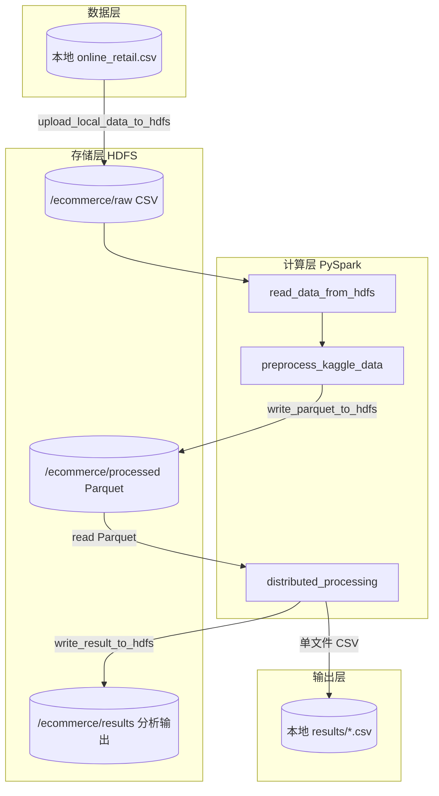
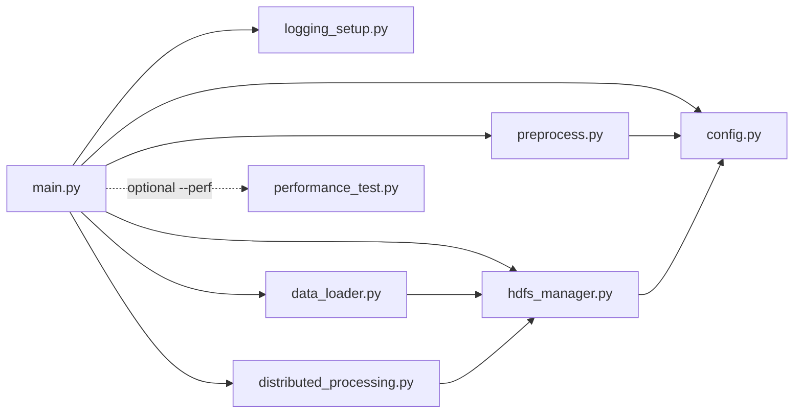

# 分布式架构流程图（Mermaid）

下列图示可直接粘贴至支持 Mermaid 的 Markdown 渲染器（如 GitHub、部分 IDE 预览）。

## 全链路数据流

```mermaid
flowchart TB
  subgraph Data["数据层"]
    L[("本地 online_retail.csv")]
  end

  subgraph Store["存储层 HDFS"]
    R[("/ecommerce/raw CSV")]
    P[("/ecommerce/processed Parquet")]
    O[("/ecommerce/results 分析输出")]
  end

  subgraph Compute["计算层 PySpark"]
    RD["read_data_from_hdfs"]
    PP["preprocess_kaggle_data"]
    AN["distributed_processing"]
  end

  subgraph Out["输出层"]
    LR[("本地 results/*.csv")]
  end

  L -->|upload_local_data_to_hdfs| R
  R --> RD --> PP -->|write_parquet_to_hdfs| P
  P -->|read Parquet| AN
  AN -->|write_result_to_hdfs| O
  AN -->|单文件 CSV| LR
```

## 模块依赖关系（简化）

```mermaid
flowchart LR
  main["main.py"]
  cfg["config.py"]
  log["logging_setup.py"]
  hdfs["hdfs_manager.py"]
  dl["data_loader.py"]
  pre["preprocess.py"]
  dist["distributed_processing.py"]
  perf["performance_test.py"]

  main --> cfg
  main --> log
  main --> hdfs
  main --> dl
  main --> pre
  main --> dist
  main -.->|optional --perf| perf
  dl --> hdfs
  dist --> hdfs
  pre --> cfg
  hdfs --> cfg
```
